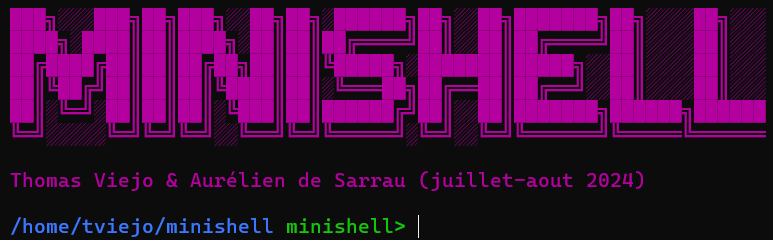

# Minishell



## Table of Contents

- [Introduction](#introduction)
- [Features](#features)
  - [Basic Functions](#basic-functions)
  - [Builtins](#builtins)
  - [Bonus Features](#bonus-features)
- [Installation](#installation)
- [Usage](#usage)
- [Examples](#examples)
  - [Executing a Simple Command](#executing-a-simple-command)
  - [Using Builtins](#using-builtins)
  - [Changing Directory](#changing-directory)
  - [Redirections and Pipes](#redirections-and-pipes)
  - [Handling Signals](#handling-signals)
  - [Bonus Features Examples](#bonus-features-examples)
- [Authors](#authors)

## Introduction

**Minishell** is a project developed by [tviejo](https://github.com/tviejo) and [ade-sarr](https://github.com/ade-sarr) as part of the curriculum at School 42. The goal of this project is to create a miniature version of the Unix shell, replicating essential functionalities of **bash** with a focus on POSIX compliance. Minishell allows users to execute commands, handle input/output redirections, manage environment variables, and more, providing a foundational understanding of shell operations.

## Features

### Basic Functions

- **Redirections**
  - Output Redirection: `>`
  - Append Redirection: `>>`
  - Heredoc: `<<`
- **Pipes**
  - Chain commands using `|`
- **Quotes Handling**
  - Double Quotes: `" "`
  - Single Quotes: `' '`
- **Error Handling**
  - Return values using `$?`
- **Environment Variables**
  - Access and modify environment variables
- **Signal Handling**
  - `Ctrl+D` to exit
  - `Ctrl+C` to interrupt
  - `Ctrl+\` to quit

### Builtins

- **echo**
  - Usage: `echo [-n] [string ...]`
  - Supports the `-n` option to omit the trailing newline
- **cd**
  - Usage: `cd [directory]`
  - Supports only relative or absolute paths
- **pwd**
  - Usage: `pwd`
  - Prints the current working directory
- **export**
  - Usage: `export [variable]`
  - Adds or modifies environment variables
- **unset**
  - Usage: `unset [variable]`
  - Removes environment variables
- **env**
  - Usage: `env`
  - Displays all environment variables
- **exit**
  - Usage: `exit`
  - Exits the shell

### Bonus Features

- **Logical Operators**
  - AND: `&&`
  - OR: `||`
- **Subshells**
  - Usage: `()`
  - Execute commands in a subshell
- **Wildcards**
  - Support for wildcard characters like `*` and `?`

## Installation

To install and set up Minishell on your local machine, follow these steps:

1. **Clone the Repository**

   ```bash
   git clone https://github.com/tviejo/42Cursus-Minishell.git
   ```

2. **Navigate to the Project Directory**

   ```bash
   cd minishell
   ```

3. **Compile the Project**

   Ensure you have `make` and a compatible C compiler installed.

   ```bash
   make
   ```

   This will generate the `minishell` executable.

## Usage

Run Minishell by executing the compiled binary:

```bash
./minishell
```

Once inside the shell, you can start typing commands as you would in a standard bash shell.

### Exiting Minishell

- Press `Ctrl+D` or type `exit` to exit the shell.

## Examples

### Executing a Simple Command

```bash
minishell> ls -la
```

### Using Builtins

```bash
minishell> echo -n "Hello, World!"
Hello, World!minishell>
```

### Changing Directory

```bash
minishell> cd /usr/local
minishell> pwd
/usr/local
```

### Redirections and Pipes

```bash
minishell> cat file.txt | grep "search_term" > output.txt
```

### Handling Signals

- Pressing `Ctrl+C` will interrupt the current command.
- Pressing `Ctrl+\` will quit the shell.

### Bonus Features Examples

#### Logical Operators (`&&`, `||`)

- **AND (`&&`) Example:**

  ```bash
  minishell> mkdir new_folder && cd new_folder
  ```

  - **Explanation:** Creates a new directory named `new_folder` and changes into it only if the `mkdir` command succeeds.

- **OR (`||`) Example:**

  ```bash
  minishell> cd nonexistent_folder || echo "Failed to change directory"
  ```

  - **Explanation:** Attempts to change to `nonexistent_folder`. If it fails, it echoes an error message.

#### Subshells (`()`)

- **Subshell Example:**

  ```bash
  minishell> (cd /tmp && ls)
  ```

  - **Explanation:** Changes to the `/tmp` directory and lists its contents within a subshell. The current shell's directory remains unchanged.

- **Complex Subshell Example:**

  ```bash
  minishell> (echo "Starting backup" > backup.log && cp -r /source /backup >> backup.log) && echo "Backup successful" || echo "Backup failed"
  ```

  - **Explanation:** Executes a series of commands within a subshell to perform a backup. Logs the process and provides success or failure messages based on the outcome.

#### Wildcards (`*`, `?`)

- **Asterisk (`*`) Example:**

  ```bash
  minishell> ls *.c
  ```

  - **Explanation:** Lists all files with a `.c` extension in the current directory.

- **Question Mark (`?`) Example:**

  ```bash
  minishell> ls file?.txt
  ```

  - **Explanation:** Lists files like `file1.txt`, `file2.txt`, etc., but not `file10.txt`.

- **Combined Wildcards Example:**

  ```bash
  minishell> ls src/*Test?.py
  ```

  - **Explanation:** Lists Python test files in the `src` directory that match the pattern, such as `src/MyTest1.py` but not `src/MyTest10.py`.

- **Using Wildcards with Pipes:**

  ```bash
  minishell> ls *.txt | grep "report" > reports.txt
  ```

  - **Explanation:** Lists all `.txt` files, filters those containing the word "report", and redirects the output to `reports.txt`.

- **Wildcard in Subshell:**

  ```bash
  minishell> (cd documents && ls *.pdf)
  ```

  - **Explanation:** Changes to the `documents` directory within a subshell and lists all `.pdf` files without affecting the current shell's directory.

## Authors

- **tviejo** - [tviejo](https://github.com/tviejo)
- **ade-sarr** - [ade-sarr](https://github.com/ade-sarr)
